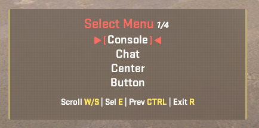

# MenuManagerAPI

MenuManagerAPI takes the powerful groundwork established by [MenuManagerCS2](https://github.com/NickFox007/MenuManagerCS2) and elevates it. We've refined the core concepts to offer a smarter, faster, and more versatile experience, focusing on:

- **A Modern Look & Feel**: Say goodbye to outdated menus. MenuManagerAPI gives you a stylish and highly customizable button menu right out of the box, making interactions more engaging for players.

- **Built for Efficiency**: Whether you have a small, simple menu or a complex one, MenuManagerAPI is engineered to be lightweight and responsive. Its intelligent design ensures menus open and respond quickly, providing a smoother experience for everyone.

- **Effortless Integration for Developers**: If you're currently using [MenuManagerCS2](https://github.com/NickFox007/MenuManagerCS2), switching is a breeze. We've kept the core API consistent, meaning you can upgrade your existing plugins with
minimal changes and immediately benefit from these performance and UI improvements.

## Credits

This plugin has incorporated code and/or design principles from the following plugins:

- [WASDMenuAPI](https://github.com/Interesting-exe/WASDMenuAPI)
- [MenuManagerCS2](https://github.com/NickFox007/MenuManagerCS2)

This plugin also utilizes [PlayerSettngsCS2](https://github.com/NickFox007/PlayerSettingsCS2) for storing menu types as player settings.

## Commands

Players can say `!changemenu` to change their preferred menu type. 



Alternatively, Use `!changemenu button` to change to an available menu type. 

## Configuration

Below is the full configuration structure for MenuManagerAPI (v2+). All config options are shown with their default values and types:

```jsonc
{
  "Version": 2,
  "DefaultMenu": "ButtonMenu", // MenuType enum: ButtonMenu, ChatMenu, CenterMenu, ConsoleMenu
  "ButtonMenu": {
    "OptionCount": true,
    "MoveWithOpenMenu": false,
    "UseVelocityModifier": false,
    "EnabledOptionColor": "white",
    "DisabledOptionColor": "#aaaaaa",
    "ButtonsConfig": {
      "UpButton": "Forward",
      "DownButton": "Back",
      "LeftButton": "Moveleft",
      "RightButton": "Moveright",
      "SelectButton": "Use",
      "ExitButton": "Reload",
      "BackButton": "Duck"
    },
    "ButtonSounds": {
      "Scroll": "",
      "Click": "",
      "Back": "",
      "Exit": "",
      "Disabled": ""
    },
    "Title": {
      "Color": "red",
      "FontSize": "M", // See FontSize section below
      "Bold": false,
      "Italic": false
    },
    "Selection": {
      "Color": "red",
      "FontSize": "SM",
      "Bold": false,
      "Italic": false
    },
    "Footer": {
      "FontSize": "S",
      "Separator": {
        "Color": "white",
        "Bold": false,
        "Italic": false
      },
      "Button": {
        "Color": "gold",
        "Bold": true,
        "Italic": false
      }
    }
  }
}
```

## Player Button Reference

You can use any of the following values for button bindings in your config (e.g., `UpButton`, `SelectButton`). These map to the in-game controls. For the full list, see the PlayerButtons enum in CounterStrikeSharp:

| Name      | Value (Hex)      | Typical Key |
|-----------|------------------|-------------|
| Forward   | 0x8              | W           |
| Back      | 0x10             | S           |
| Moveleft  | 0x200            | A           |
| Moveright | 0x400            | D           |
| Use       | 0x20             | E           |
| Reload    | 0x2000           | R           |
| Duck      | 0x4              | CTRL        |
| Jump      | 0x2              | SPACE       |
| Attack    | 0x1              | Mouse1      |
| Attack2   | 0x80             | Mouse2      |
| Alt1      | 0x10000          | ALT         |
| Alt2      | 0x20000          | ALT2        |
| Speed     | 0x100            | SHIFT       |
| Walk      | 0x40000          | WALK        |
| Run       | 0x80000          | RUN         |
| Tab       | 0x200000000      | TAB         |
| Grenade1  | 0x1000000        | G1          |
| Grenade2  | 0x2000000        | G2          |
| Weapon1   | 0x100000         | 1           |
| Weapon2   | 0x200000         | 2           |
| Zoom      | 0x400000         | ZOOM        |

Refer to the PlayerButtons enum in CounterStrikeSharp for all possible values.

---

## Font Size Options

The following font size names are available for use in config (case-insensitive):

| Name | Value (px) | CSS Class      |
|------|------------|---------------|
| XS   | 8          | fontSize-xs   |
| S    | 12         | fontSize-s    |
| SM   | 16         | fontSize-sm   |
| M    | 18         | fontSize-m    |
| ML   | 20         | fontSize-ml   |
| L    | 24         | fontSize-l    |

Use these names for any `FontSize` property in the config (e.g., "FontSize": "SM").

## Language Support

Below is an example of the actual `en.json` lang file. You can add or override keys for your own language files as needed.

```json
{
  "menutype.select": "Select Menu",
  "menutype.console": "Console",
  "menutype.chat": "Chat",
  "menutype.center": "Center",
  "menutype.button": "Button",
  "menutype.selected": "Selected Menu: ",
  "menutype.notfound": "{0} menu type not found.",
  "menu.selection.left": "\u25B6 [",
  "menu.selection.right": "] \u25C0",
  "menu.footer.scroll": "Scroll",
  "menu.footer.scroll.button": "W/S",
  "menu.footer.select": "Sel",
  "menu.footer.select.button": "E",
  "menu.footer.previous": "Prev",
  "menu.footer.previous.button": "CTRL",
  "menu.footer.exit": "Exit",
  "menu.footer.exit.button": "R"
}
```

## Color Normalization (For Developers)

MenuManagerAPI provides robust color handling for menu text, giving developers fine control over how colors are rendered in Button Menus:

- **Color Token Normalization:**
  - If your menu header or option contains a `{color}` token, MenuManagerAPI will convert this to an HTML `<font color='color'>...</font>` tag for display. 
  - If no color token is present, the configured color from your menu style (e.g., `EnabledOptionColor`, `Title.Color`) is used as a fallback.
<<<<<<< Updated upstream

- **HTML Support:**
=======
>>>>>>> Stashed changes
  - You can use raw HTML `<font color='...'>` tags in your menu text for advanced customization. These will be preserved and rendered as-is.
  - Color tokens will override all colors in the configuration file

**Summary:**
  - Use `{color}` tokens for simple, portable colorization. This can be from a config file or directly hard-coded. 
  - Use raw HTML for advanced needs.

## Why MenuManagerAPI is Better (For Developers & Servers)

MenuManagerAPI is designed from the ground up for both developer productivity and server performance:

### For Developers
- **Consistent, Predictable API:** The API is stable and mirrors CounterStrikeSharp and MenuManagerCS2, making migration and integration easy.
- **Automatic Color Handling:** No need to manually parse or wrap color tokens—MenuManagerAPI does it for you, with clear config options.
- **Multiple Menu Types:** Easily switch between Button, Chat, Center, and Console menus. Player preferences are respected automatically.
- **Extensible & Modular:** Built with dependency injection and clean separation of concerns, so you can add features or swap out components with minimal friction.
- **Strong Typing & Null Safety:** All config and API surfaces are strongly typed, reducing runtime errors and making code easier to reason about.

### For Servers
- **Performance Optimized:** Uses pooled StringBuilders and efficient rendering logic to minimize allocations and maximize responsiveness, even with large menus.
 - **Global OnTick Listener:** Like CounterStrikeSharp's built-in ChatMenu and CenterHtmlMenu, MenuManagerAPI uses a global OnTick listener to track and update all open menus. This ensures centralized state management and a consistent, robust user experience—no stale menus, no memory leaks, and smooth updates for all players.
- **Event-Driven Cleanup:** Menu state is always cleaned up on round end, disconnect, or map change—no memory leaks or stale menus.
- **Graceful Degradation:** If a menu type or dependency is missing, the system falls back to chat commands or other available types, ensuring menus always work.
- **Player Preference Persistence:** Menu type and settings are stored per-player, so users always get their preferred experience.
- **Battle-Tested:** Built on lessons learned from MenuManagerCS2 and WASDMenuAPI, with a focus on reliability and real-world usability.

**Bottom Line:** MenuManagerAPI is the most robust, developer-friendly, and performant menu system for CounterStrikeSharp servers. It saves you time, reduces bugs, and gives your players a better experience.

## Interface

```csharp
public interface IMenuAPI
{
    public IMenu GetMenu(string title, Action<CCSPlayerController>? backAction = null, Action<CCSPlayerController>? resetAction = null, MenuType? forceType = null);
    public MenuType GetMenuType(CCSPlayerController player);
    public bool HasOpenedMenu(CCSPlayerController player);
    public void OpenMenu(IMenu menu, CCSPlayerController player);
    public void OpenMenuToAll(IMenu menu);
    public void CloseMenu(CCSPlayerController player);
    public void CloseMenuForAll();
    public void RefreshMenu(CCSPlayerController player);
}
```

## Example Usage

```csharp
// Included libraries
using MenuManagerAPI.Shared;
using CounterStrikeSharp.API;
using CounterStrikeSharp.API.Core;
using CounterStrikeSharp.API.Modules.Menu;
using CounterStrikeSharp.API.Modules.Commands;
using CounterStrikeSharp.API.Core.Capabilities;
using CounterStrikeSharp.API.Core.Attributes.Registration;

// Define plugin class
public class Plugin : BasePlugin
{
    // Define module properties
    public override string ModuleName => "Example Menu";
    public override string ModuleVersion => "1.0.1";
    public override string ModuleAuthor => "Striker-Nick";
    public override string ModuleDescription => "Example Menu Plugin";

    // Define class properties
    private IMenuApi? _api;
    private readonly PluginCapability<IMenuApi?> _pluginCapability = new("menu:api");    

    // Define class methods
    public override void OnAllPluginsLoaded(bool hotReload)
    {
        _api = _pluginCapability.Get();
        if (_api == null) Console.WriteLine("MenuManagerAPI not found...");
    }

    [ConsoleCommand("css_test_menu", "Test menu!")]
    public void OnCommand(CCSPlayerController? player, CommandInfo command)
    {
        if (player != null)
        {            
            IMenu? menu = _api.GetMenu("Menu Title");
            menu!.PostSelectAction = PostSelectAction.Close;

            for (int i = 0; i < 10; i++)
            {
                menu.AddMenuOption($"itemline{i}", (player, option) =>
                {
                    player.PrintToChat($"Selected: {option.Text}");
                    //_api.CloseMenu(player);
                });
            }
            menu.Open(player);
            // _api.OpenMenu(menu, player);
        }
    }
}
```

## TODO
- [x] Chat Menu
- [x] Center Menu
- [x] Console Menu
- [x] Button Menu
  - [x] Sound
  - [x] Styling
  - [x] Option Counter
  - [x] Velocity Modifier
  - [x] Global OnTick function

## Need Help?

Still need help? [create a new issue](https://github.com/nickj609/MenuManagerAPI/issues/new/choose).
